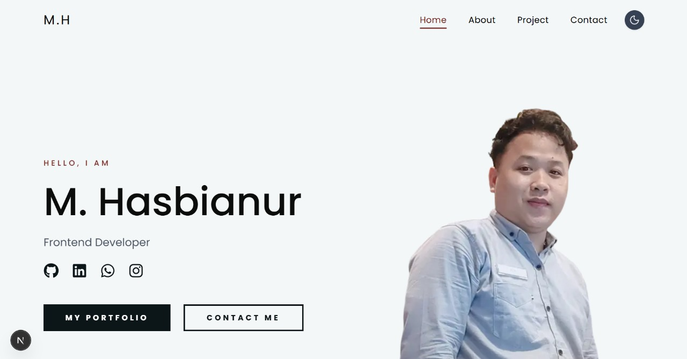

# Web-Personal

Web Personal adalah website portofolio pribadi yang dirancang untuk menampilkan profil, keterampilan, serta proyek-proyek yang telah saya kerjakan secara profesional dan interaktif. Tujuan utama dari website ini adalah memberikan kesan pertama yang kuat kepada pengunjung, terutama calon klien atau rekruter, melalui desain modern dan pengalaman pengguna yang halus.

✨ **Live Demo:** https://web-personal-eosin.vercel.app/

---

## 📸 Tampilan


---

## 🚀 Fitur Utama

- **Portofolio Interaktif** — menampilkan profil, skill, dan proyek secara profesional.
- **Animasi Halus** — memanfaatkan Framer Motion untuk transisi yang lembut & modern.
- **Desain Responsif** — tampil optimal di berbagai ukuran layar.
- **Performa Tinggi** — dibangun dengan Next.js + Vercel untuk waktu muat cepat & stabil.

---

## 🛠 Teknologi yang Digunakan

| Teknologi      | Fungsi                                                |
|----------------|--------------------------------------------------------|
| **Next.js**    | Framework frontend untuk performa tinggi & SEO         |
| **Tailwind CSS** | Styling modern, cepat, dan konsisten                  |
| **Framer Motion** | Animasi UI yang halus dan interaktif                |
| **Vercel**       | Deployment cepat, stabil, optimal untuk Next.js       |

---

## 👤 Peran Saya

Sebagai **Frontend Developer**, saya bertanggung jawab untuk:

- Mendesain UI/UX website dari nol.
- Membangun struktur halaman dan komponen utama.
- Menambahkan animasi transisi agar lebih hidup & profesional.
- Mengoptimalkan performa agar tetap ringan, responsif, dan konsisten.

---

## 🔥 Tantangan

- Menyeimbangkan desain estetis dengan kecepatan loading.
- Membuat tampilan tetap konsisten di berbagai perangkat.
- Menghadirkan animasi smooth tanpa menurunkan performa website.

---

## ✅ Solusi

- Menggunakan **Next.js** untuk kecepatan, routing, dan optimasi gambar.
- Menggunakan **Tailwind CSS** untuk styling cepat & fleksibel.
- Mengimplementasikan **Framer Motion** untuk animasi elegan dan ringan.
- Melakukan deployment menggunakan **Vercel** agar website stabil & cepat diakses.

---

## 📁 Struktur Proyek (Ringkas)
```bash
/app
  ├── page.tsx        # Landing page utama
  ├── globals.css     # Style Global
/components
  ├── ...# Komponen UI

/public
  ├── projectt4.jpg   # Screenshot tampilan
```

---

## 🧩 Cara Menjalankan Proyek

```bash
# Install dependencies
npm install

# Jalankan development server
npm run dev

# Buka di browser
http://localhost:3000


